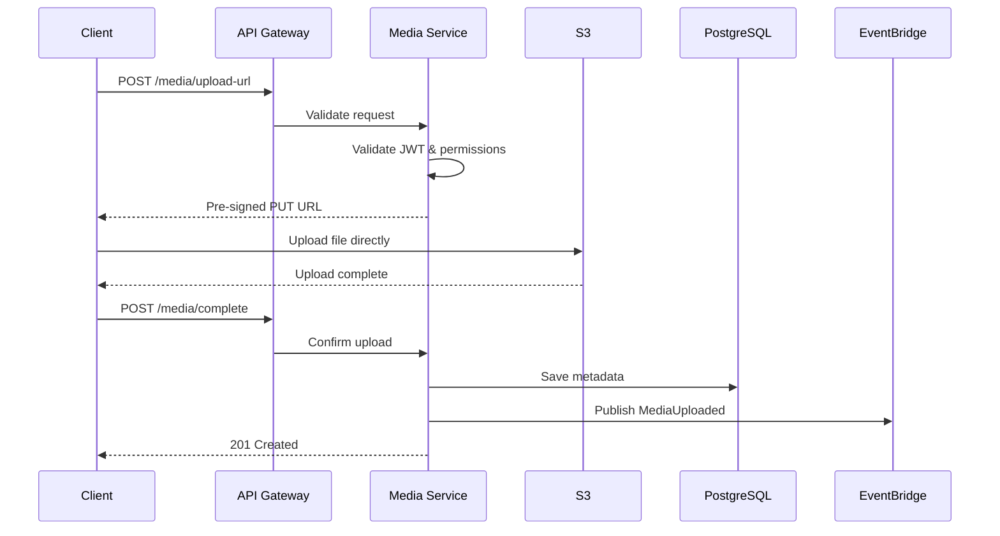
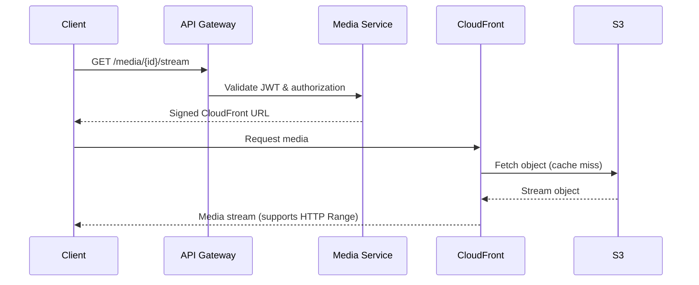

# Media Streaming Technical Design

**Distributed Task Manager – Media Streaming Module**

---

# 1. Purpose

The Media Streaming module enables users to upload, manage, and stream video/audio attachments directly from tasks without routing media traffic through compute resources.

The design follows the overall application architecture:

* Distributed microservices
* AWS Serverless
* Event-driven communication
* Stateless services
* Secure object storage
* CDN-based streaming

---

# 2. Design Goals

## Functional Goals

* Upload video/audio attachments
* Stream media inside tasks
* Secure media access
* Associate media with exactly one task
* Display metadata
* Replace/delete attachments
* Support seeking
* Support adaptive streaming (future)

---

## Non-functional Goals

* Low latency playback (<3 seconds)
* Infinite horizontal scalability
* No media proxy through Lambda
* Cost-efficient bandwidth
* Secure access using temporary credentials
* Support resumable uploads
* High durability (Amazon S3)

---

# 3. Architecture Overview

```
                Upload Flow

Browser
    │
    ▼
API Gateway
    │
    ▼
Media Service (Lambda)
    │
    ├───────────────► PostgreSQL
    │                     │
    │                     ▼
    │                Media Metadata
    │
    └───────────────► Generate Upload URL
                          │
                          ▼
                     Amazon S3
                          │
                    Object Created
                          │
                          ▼
                    EventBridge Event
                          │
          ┌───────────────┴───────────────┐
          ▼                               ▼
 Thumbnail Processor             Reporting Service


                Playback Flow

Browser
    │
    ▼
API Gateway
    │
    ▼
Media Service
    │
Generate Signed URL
    │
    ▼
CloudFront
    │
    ▼
Amazon S3
```

---

# 4. AWS Services

| Service         | Responsibility    |
| --------------- | ----------------- |
| API Gateway     | Public API        |
| Lambda          | Business logic    |
| S3              | Media storage     |
| CloudFront      | Media delivery    |
| EventBridge     | Event propagation |
| PostgreSQL      | Metadata          |
| IAM             | Access control    |
| Secrets Manager | Credentials       |
| CloudWatch      | Logs              |
| X-Ray           | Tracing           |

---

# 5. Components

## 5.1 Media Service

Responsibilities

* Validate JWT
* Validate ownership
* Generate upload URLs
* Generate streaming URLs
* Store metadata
* Delete metadata
* Replace media
* Publish events

No media bytes pass through Lambda.

---

## 5.2 S3 Bucket

Stores

```
videos/
    task-id/
        uuid.mp4

audio/
    task-id/
        uuid.mp3

thumbnails/
    task-id/
        uuid.jpg

hls/
    task-id/
        playlist.m3u8
        segment001.ts
        ...
```

Bucket

Private

Encryption

AES-256 / SSE-S3

Lifecycle

* Abort incomplete uploads
* Optional archive after X months
* Delete temporary objects

---

## 5.3 CloudFront

Responsibilities

* Global caching
* HTTP Range Requests
* Streaming optimization
* TLS
* Signed URLs
* Cache-Control

Origin

Amazon S3

---

# 6. Metadata Model

MediaAttachment

```
id

task_id

uploaded_by

media_type

original_filename

storage_key

mime_type

duration

size

checksum

thumbnail_key

created_at
```

Metadata is stored independently from the binary object.

---

# 7. Upload Design

## Step 1

Client requests upload

```
POST

/media/upload-url
```

Request

```
{
  taskId,
  filename,
  contentType,
  fileSize
}
```

---

## Step 2

Media Service validates

* JWT
* Task exists
* Permission
* MIME type
* Size

---

## Step 3

Generate S3 Pre-signed Upload URL

Example

```
PUT

https://bucket.s3.amazonaws.com/...
```

Expiration

10 minutes

---

## Step 4

Browser uploads directly

```
Browser

────────► S3
```

Lambda is not involved.

---

## Step 5

Upload confirmation

```
POST

/media/complete
```

Payload

```
{
    uploadId,
    taskId,
    storageKey,
    duration,
    checksum
}
```

---

## Step 6

Media Service

Stores metadata

Publishes

```
MediaUploaded
```

---

# 8. Playback Design

## Request

```
GET

/media/{id}/stream
```

---

Validation

* JWT
* Task visibility
* RBAC
* Ownership

---

Generate

Signed CloudFront URL

Expiration

5 minutes

---

Response

```
{
   streamUrl,
   expiresAt
}
```

---

Browser

Streams directly

```
Browser

↓

CloudFront

↓

S3
```

---

# 9. Seeking Support

Seeking works automatically because

CloudFront

↓

S3

support

HTTP Range Requests

Example

```
Range:

bytes=400000-800000
```

The browser media player requests only the required bytes.

No backend implementation required.

---

# 10. Adaptive Streaming (Release 3)

Current MVP

```
MP4

MP3
```

Future

```
Upload

↓

MediaConvert

↓

Generate

480p

720p

1080p

↓

HLS Playlist

↓

CloudFront
```

Playback

```
playlist.m3u8

↓

Player

↓

Automatic bitrate selection
```

---

# 11. Thumbnail Generation

After upload

```
MediaUploaded

↓

EventBridge

↓

Thumbnail Lambda

↓

FFmpeg

↓

thumbnail.jpg

↓

S3

↓

Update Metadata

↓

ThumbnailGenerated
```

Entirely asynchronous.

---

# 12. Event Model

Published Events

```
MediaUploadRequested

MediaUploaded

MediaReplaced

MediaDeleted

ThumbnailGenerated
```

Consumers

| Event              | Consumer            |
| ------------------ | ------------------- |
| MediaUploaded      | Reporting           |
| MediaUploaded      | Thumbnail Processor |
| MediaDeleted       | Reporting           |
| ThumbnailGenerated | Media Service       |

---

# 13. REST API

## Request Upload URL

```
POST /media/upload-url
```

---

## Confirm Upload

```
POST /media/complete
```

---

## Generate Streaming URL

```
GET /media/{id}/stream
```

---

## Metadata

```
GET /media/{id}
```

---

## Delete

```
DELETE /media/{id}
```

---

## Replace

```
PUT /media/{id}
```

---

# 14. Security Design

Authentication

JWT

Authorization

RBAC

Storage

Private S3 Bucket

Media Access

CloudFront Signed URLs

Upload

Pre-signed PUT URL

Download

Short-lived signed URL

Encryption

* HTTPS/TLS
* SSE-S3
* Encrypted database

Validation

* MIME type whitelist (`video/mp4`, `audio/mpeg`, `audio/wav`, etc.)
* Maximum upload size
* Filename sanitization
* Checksum verification
* Virus scanning (future enhancement)

---

# 15. Failure Handling

| Scenario                                | Strategy                                                                          |
| --------------------------------------- | --------------------------------------------------------------------------------- |
| Upload interrupted                      | Client retries using a new pre-signed URL or multipart upload                     |
| Upload URL expired                      | Request a new upload URL                                                          |
| Metadata persistence fails after upload | Retry via EventBridge/Outbox; orphaned objects cleaned by scheduled lifecycle job |
| S3 unavailable                          | Automatic AWS retry mechanisms; client retry on failure                           |
| Unauthorized playback                   | Return HTTP 403                                                                   |
| Media deleted                           | Return HTTP 404                                                                   |
| Invalid MIME type                       | Return HTTP 415                                                                   |
| File exceeds configured limit           | Return HTTP 413                                                                   |

---

# 16. Observability

### Metrics

* Upload count
* Upload duration
* Upload success rate
* Playback requests
* Signed URL generation latency
* S3 upload failures
* CloudFront cache hit ratio
* Average playback startup time

### Logging

Structured JSON logs with:

* Request ID
* User ID
* Task ID
* Media ID
* S3 object key
* Operation
* Status
* Execution time

### Tracing

AWS X-Ray traces:

* API Gateway → Lambda
* Lambda → PostgreSQL
* Lambda → S3 SDK
* EventBridge → Thumbnail Processor

---

# 17. Sequence Diagrams

## Upload Sequence



## Playback Sequence



---

# 18. Scalability Considerations

* **Stateless Lambdas** enable independent horizontal scaling without session affinity.
* **Direct browser-to-S3 uploads** eliminate Lambda bandwidth bottlenecks and reduce costs.
* **CloudFront edge caching** minimizes latency and origin load for frequently accessed media.
* **EventBridge** decouples post-processing (thumbnails, analytics, reporting) from user-facing operations.
* **Multipart uploads** should be enabled for files larger than 100 MB to improve reliability and resumability.
* **Adaptive HLS streaming** can be introduced later without changing the client-facing API, preserving backward compatibility with the MVP architecture.
